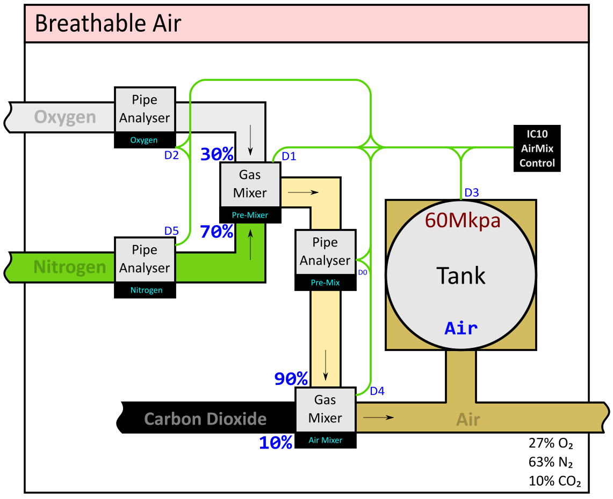
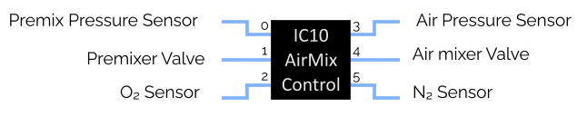

Note that the actual source files are the ones
ending with `.icx`, and these are "compiles" into
Stationeers MIPS which generates the harder-to-read `.ic10` files.
It is the `.ic10` files that need to be copy-and-pasted into the game's editor.

# Atmospherics

## Breathable Air Mix Controller

The BAM Controller will control a pair of Pipe Gas Mixers to produce a 
standard breathable atmoshpere.

Given an input of Oxygen, Nitrogen and Carbon Dioxide, it will produce a 
27%/63%/10% mix of those.

The controller will act to prevent over-pressure of the intermediate
O2/N2 mix pipe, and of the output tank.

If connected to a Tank or Pipe Analyser on the input side, the controller will
also keep a small amount of pressure on the input gasses, so as not to use
them all up.
Only the O2 and N2 are monitored, both due to running
out of IC10 pins and because 2 doesn't seem to be as valuable.

The following devices can be connected to the IC10 Housing
(ones with a * are optional):

* **D0**  - a Pipe Analyser or Tank on the intermediate pre-mix pipe
* **D1**  - a Pipe Gas Mixer connected to Oxygen (30%) and Nitrogen (70%)
* **D2*** - a Pipe Analyser or Tank on the input Oxygen pipe
* **D3**  - a Pipe Analyser or Tank on the output air pipe
* **D4**  - a Pipe Gas Mixer connected to the pre-mix (90%) and Carbon Dioxide (10%)
* **D5*** - a Pipe Analyser or Tank on the input Nitrogen pipe

